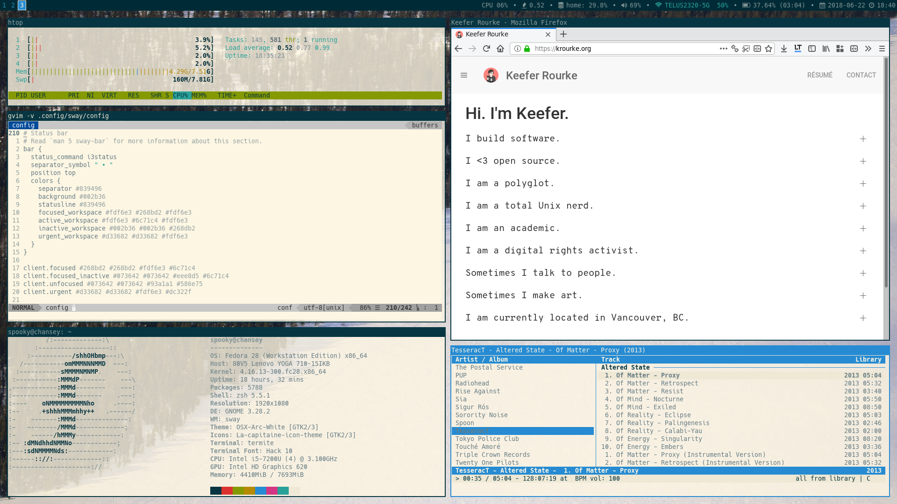

# dotfiles

This repository contains some of my common configuration files. I keep track of
them in this repository with the help of
[this tool](https://github.com/jbernard/dotfiles).

## Current set-up
- Display server: Wayland
- Window manager: [sway](http://swaywm.org) 
- Status bar: swaybar with [i3status](https://github.com/i3/i3status)
- Terminal: [termite](https://github.com/thestinger/termite)
- File manager: [ranger](http://ranger.github.io)
- Image viewer: feh
- Editor: vim 8
- Shell: zsh (with [oh-my-zsh](https://github.com/robbyrussell/oh-my-zsh))
- Browser: Firefox 60

## Dirty preview

## Contents
 - config
    + i3status
    + ranger
    + sway
    + termite
 - vimrc
 - [vim-autoformat](https://github.com/Chiel92/vim-autoformat) formatter files
 - zshrc
 - bin
   + misc scripts (copy to /usr/local/bin)

## License
The contents of this repository are licensed under the ISC License. See LICENSE
for more details.
